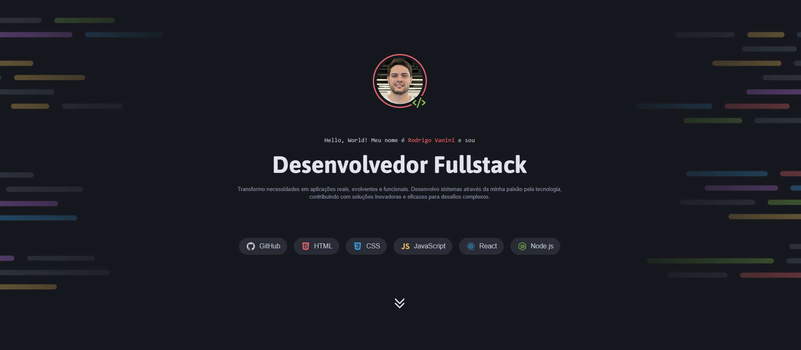

# 👨‍💻 Rodrigo Vanini Portfolio

A modern and responsive personal portfolio website built with HTML5 and CSS3, showcasing projects, skills, and contact information in an elegant and professional design.



## 🚀 Features

- **Fully Responsive Design**: Seamlessly adapts from mobile to desktop (breakpoint at 80em)
- **Dark Theme Interface**: Professional dark color palette with vibrant accent colors
- **Smooth Animations**: Polished transitions and hover effects on buttons and cards
- **Single-Page Navigation**: Smooth scroll between sections with anchor links
- **Custom Design System**: CSS variables for consistent colors, typography, and spacing
- **Modern Layouts**: Built with CSS Grid and Flexbox for optimal flexibility
- **Interactive Elements**: Hover states with icon changes and border highlights
- **Skill Showcase**: Tech stack displayed with custom skill cards
- **Project Gallery**: Featured projects with thumbnails and descriptions

## 🛠️ Technologies Used

- **HTML5**: Semantic markup structure
- **CSS3**: Advanced styling with custom properties, grid, flexbox, and media queries
- **Modular CSS**: Organized stylesheet architecture with separate files for components

## 📂 Project Structure
```
portfolio/
│
├── index.html
├── styles/
│   ├── index.css
│   ├── global.css
│   ├── utilitys.css
│   ├── buttons.css
│   ├── cards.css
│   ├── header.css
│   ├── projects.css
│   ├── services.css
│   ├── contacts.css
│   └── icons.css
├── assets/
│   ├── images/
│   │   ├── Background_Intro.png
│   │   ├── Background_Contacts.png
│   │   ├── profile_image.png
│   │   └── Thumbnail_Project-*.png
│   └── icons/
│       └── *.svg
└── README.md
```

## 💻 How to Use

1. **Clone the repository**
```bash
git clone https://github.com/eRodrigoVanini/portfolio.dev.git
```

2. **Navigate to the project folder**
```bash
cd portfolio.dev
```

3. **Open the project**
   - Simply open `index.html` in your preferred browser
   - Or use a local server like Live Server (VS Code extension)

4. **Explore the portfolio**
   - Scroll through different sections: About, Projects, Services, and Contacts
   - Click on social media buttons to connect
   - View featured projects and services offered

## 🎯 Key Sections

### About Section
Introduces Rodrigo Vanini as a Fullstack Developer with:
- Profile image with custom border styling
- Skill badges for GitHub, HTML, CSS, JavaScript, React, and Node.js
- Professional introduction and mission statement
- Smooth scroll navigation to projects section

### Projects Section
Showcases 6 featured projects including:
- **TravelGram**: Social network for travel photo sharing
- **TechNews**: Technology news portal homepage
- **Recipe Page**: Step-by-step cupcake recipe guide
- **Zingen**: Responsive landing page for karaoke app
- **Refund**: Reimbursement tracking system
- **Tourism Page**: Travel guide for Busan

### Services Section
Highlights three core service offerings:
- **Websites and Applications**: Interface development
- **API and Database**: Backend system services
- **DevOps**: Application management and infrastructure

### Contacts Section
Multiple ways to connect:
- LinkedIn profile
- Instagram account
- GitHub repositories
- Email contact

## 🎨 Design Highlights

### Color Palette
```css
--red: #e3646e
--purple: #bb72e9
--blue: #3996db
--green: #82bc4f
--yellow: #eabd5f
--gray-100: #e2e4e9
--gray-200: #c0c4ce
--gray-300: #878ea1
--gray-400: #292c34
--gray-500: #16181d
--gray-600: #0d0e11
```

### Typography System
- **Titles**: Asap font family (700 weight)
- **Subtitles**: Inconsolata monospace font
- **Body Text**: Maven Pro (400 weight)
- Responsive font sizes that scale from mobile to desktop

### Interactive Elements
- Hover effects on social media buttons with icon color changes
- Card hover states with blue border highlights
- Smooth 0.3s transitions throughout the interface
- Grid-based button layouts for optimal alignment

## 📝 Code Quality

- **Modular Architecture**: Separate CSS files for different components
- **CSS Custom Properties**: Extensive use of variables for maintainability
- **Semantic HTML**: Proper use of sections, headers, figures, and lists
- **Responsive Design**: Mobile-first approach with desktop enhancements
- **Clean Code**: Well-organized structure with consistent naming conventions
- **Reusable Utilities**: Helper classes for common patterns (flex, grid, spacing)

## 🔮 Future Enhancements

- [ ] **Animation Library**: Integrate scroll-triggered animations (AOS, GSAP)
- [ ] **Project Detail Pages**: Individual pages for each project with case studies
- [ ] **Contact Form**: Add functional contact form with backend integration
- [ ] **Skills Progress Bars**: Visual representation of skill proficiency levels
- [ ] **Multilingual Support**: Add Portuguese/English language toggle

## 🤝 Contributing

Contributions are welcome! Feel free to:
1. Fork the project
2. Create a feature branch (`git checkout -b feature/AmazingFeature`)
3. Commit your changes (`git commit -m 'Add some AmazingFeature'`)
4. Push to the branch (`git push origin feature/AmazingFeature`)
5. Open a Pull Request

## 📄 License

This project is open source and available under the [MIT License](LICENSE).

## 👨‍💻 Developer

**Rodrigo Vanini**
- GitHub: [@eRodrigoVanini](https://github.com/eRodrigoVanini)
- LinkedIn: [Rodrigo Vanini](https://www.linkedin.com/in/erodrigovanini)

---

⭐ If you found this project useful, please consider giving it a star!

**Built with ❤️ and CSS**
